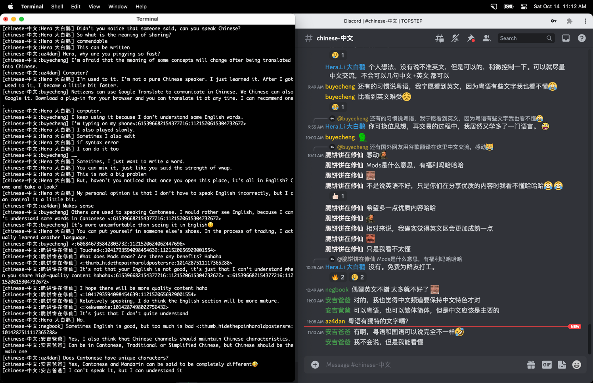

# discordlog

log discord messages


## usage

```
% discordlog -h
usage:
--auth | -a <discord_auth> (required)
--channels | -c <channel_ids> (required)
--users | -u <usernames>
--keywords | -k <keywords>
--translate | -t
--limit | -l <fetches>
--poll | -p <seconds>
--skip | -s
--help | -h
```


## example

```
% discordlog -a <auth> -c 1139364504594042940 -u dan,nick,sean -k buy,sell | tee -a trades.log
```


## screenshot


